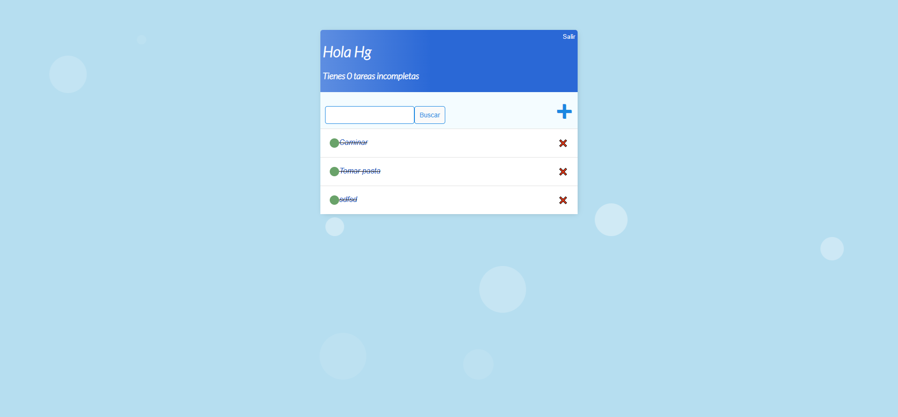
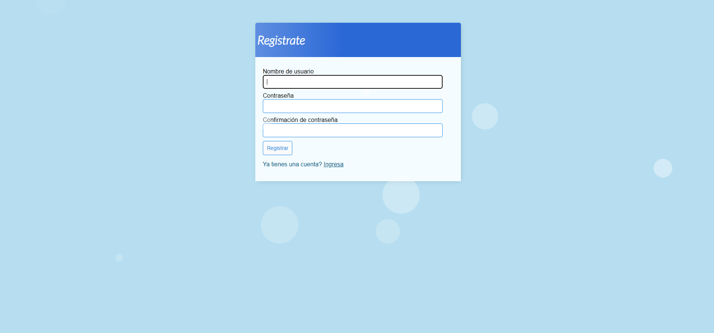

<<<<<<< HEAD

# AGENDA_WEB_PYTHON


**Agenda web** Esta es una agenda web en la que puedes organizar tus tareas pendientes de manera efectiva y rapida, se pueden "tachar" las tareas ya realizadas, esto permite diferenciar las tareas "pendientes" de las "realizadas", este programa cuenta con sistema de loggin. 


Este proyecto personal fue desarrollado con **Python** utilizando **Django** para la gestión web.


## Screenshots





## Features

- **Registrarse:** Se puede crear una cuenta, registrar sesión y/o cerrar sesión
- **Agregar tarea:** Se agregan tareas que se almacenan en una lista
- **Realizar tarea:** Se marca la tarea como "realizada"


## Tech Stack

**Frontend:** HTML CSS

**Backend:** Python


## Run Locally

Clone the project

```bash
  git clone https://github.com/lFelxx/AGENDA_WEB_PY.git
```

Go to the project directory

```bash
  \proyectow
```

Install dependencies

```bash
  pip install python
  pip install django
```

Start the server

```bash
  python manage.py runserver

```

=======
# AGENDA_WEB_PY
>>>>>>> 4a7d1b8a1cd7c582f6f7553495adbf548940273b
